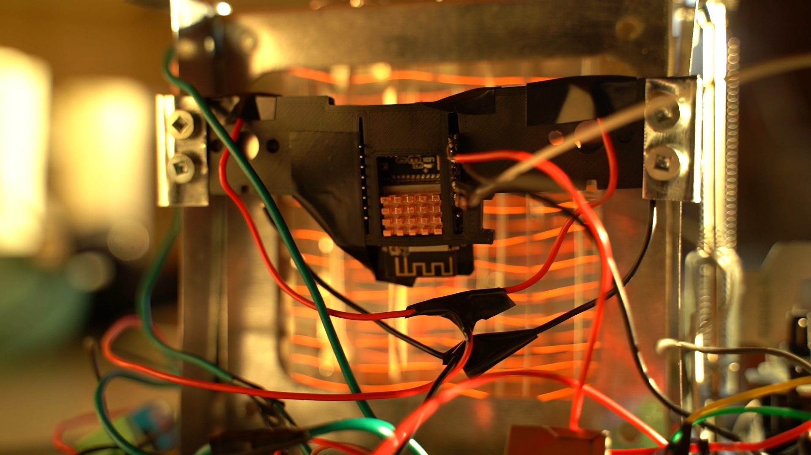

# Toast-E by Baker-E
The parent Toast-E repository is composed of a Firmware repository and a UI repository.

## Why Toast-E?

What if I told you there was a toaster that could never burn toast?

Why simply use a timer, when your toaster can be so much smarter?

Frustrated with unpredictable toast, and a total lack of innovation in the kitchen space, Baker-E, founded by an exceptional team of McMaster Mechatronics Engineering students, is excited to introduce their flagship product, Toast-E, the first toaster that combines intelligent control with a user-friendly design, ensuring perfectly toasted slices, every single time.

### [Watch Mechatronics Engineering Capstone Video 2024](https://www.youtube.com/watch?v=05CiyPLuck4 "Watch Mechatronics Engineering Capstone Video 2024")

## Report

[View Toast-E Documentation](Toast-E_Documentation.pdf)

## Project Images

|                                                      |                                                      |                                                      |                                                     |                                                     |
| :--------------------------------------------------: | :--------------------------------------------------: | :--------------------------------------------------: | :-------------------------------------------------: | :-------------------------------------------------: |
|  |  |  |  |  |  |

